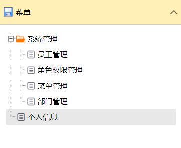
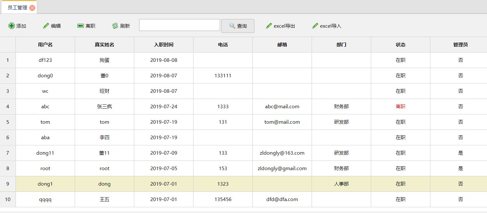

# 权限管理系统 permission project

## 开发环境
* windows 10
* IntelliJ IDEA 2019
* tomcat 9
* MySQL 8.0
* maven 3.6

## 说明
使用 spring MVC + spring + MyBatis （ssm框架）开发  
前端使用 Jquery EasyUI  

## 功能实现
### 登录
  
用户名和密码进行登录，使用Shiro安全框架验证用户身份，密码通过MD5散列函数加密  

### 菜单
  
登录后根据用户所拥有的权限给出相应的树形菜单  

### 个人信息
  
在个人信息页面员工可以自己修改自己的姓名、电话等信息和修改密码  

### 员工管理
  
员工管理页面展示所有员工信息，分页每页显示10名员工,使用pagehelper分页插件。  
上方工具栏中输入关键字可以查找到包含该关键字的员工信息，可以查找相应的用户名、真实姓名、电话或邮箱。  
拥有权限的用户可以添加、编辑和离职员工。可以添加单个，也可以通过Excel批量添加。  
  
  
通过Excel添加的需要先下载模板，按照对应的格式填写，再上传Excel文件。  
  
上图为Excel导出结果  

### 角色权限管理
  
管理员设置不同角色拥有的权限，在员工管理页中给员工添加角色  
  
一个角色可以拥有多个权限  

### 部门管理
  
部门管理页面可以对部门进行添加、编辑和删除操作  

### 日志记录
使用切面编程，在方法后面追加日志记录  
在调用每个控制器中的方法时记录下每个用户IP、时间、调用的方法名和参数，记录添加到数据库中  
